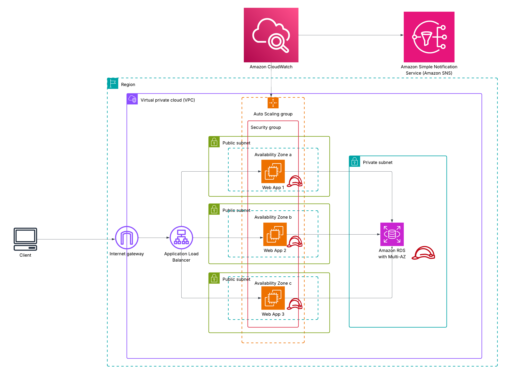

# 🖥️ Scalable Web Application on AWS

This repository contains the architecture for a highly available, scalable web application deployed on Amazon Web Services (AWS). The application is deployed using EC2 instances behind an Application Load Balancer (ALB) with Auto Scaling Groups (ASG). It integrates monitoring with Amazon CloudWatch and alerting with Amazon SNS. Amazon RDS with Multi-AZ deployment is used as a backend database.

---

## 📌 Solution Architecture

---

## 🧱 Architecture Components

| Component                   | Description |
|----------------------------|-------------|
| **EC2**                    | Hosts the web application in multiple AZs for fault tolerance. |
| **Application Load Balancer (ALB)** | Distributes incoming traffic across EC2 instances. |
| **Auto Scaling Group (ASG)** | Scales instances based on traffic/load. |
| **Amazon RDS (optional)**  | Managed relational database service (Multi-AZ). |
| **Amazon CloudWatch**      | Collects logs and metrics. |
| **Amazon SNS**             | Sends notifications based on monitoring alerts. |
| **IAM Roles**              | Provide secure access to AWS services. |
| **VPC & Subnets**          | Secure and segmented network. |

---

## 🚀 Deployment Instructions

Please refer to [`docs/setup-instructions.md`](docs/setup-instructions.md) for full step-by-step deployment instructions.

---

## 📄 Documentation

- [`architecture-description.md`](architecture-description.md): Detailed explanation of the architecture and design decisions.

---

## 📦 Technologies Used

- AWS EC2, ALB, ASG, RDS, CloudWatch, SNS, IAM, VPC
- (Add app tech: e.g., Flask, Node.js, Apache, etc.)

---

